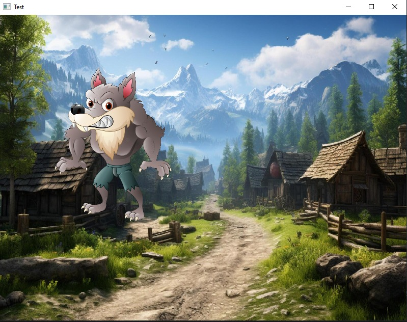
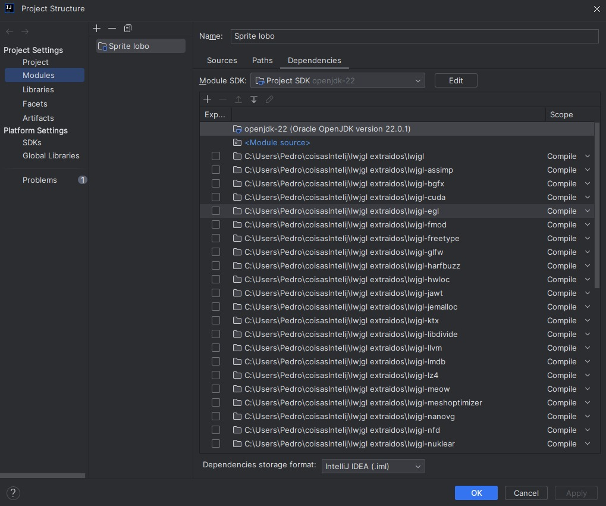

# OpenglEmJava
Trabalho da facul de opengl que optei por fazer no Java

Visão do código executando:

Para executar esse código sem problemas, primeiro deve ser baixar o lwjgl e colocar no intelij

