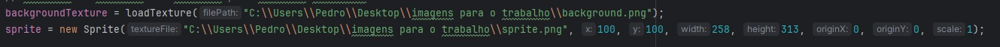

# OpenglEmJava
Trabalho da facul de opengl que optei por fazer no Java

Visão do código executando:

Para executar esse código sem problemas, primeiro deve ser baixar o lwjgl no link https://www.lwjgl.org/download
e colocar no intelij como mostrado abaixo, todas as pastas após tirar do zip

Nessas linhas colocar o caminho para a imagem que queira, cuidando o nome de cada uma
no Sprite pode-se ajustar os paramtros para ficar maior, menor, mudar de posição, rotacionar etc, nos numeros após o caminho

